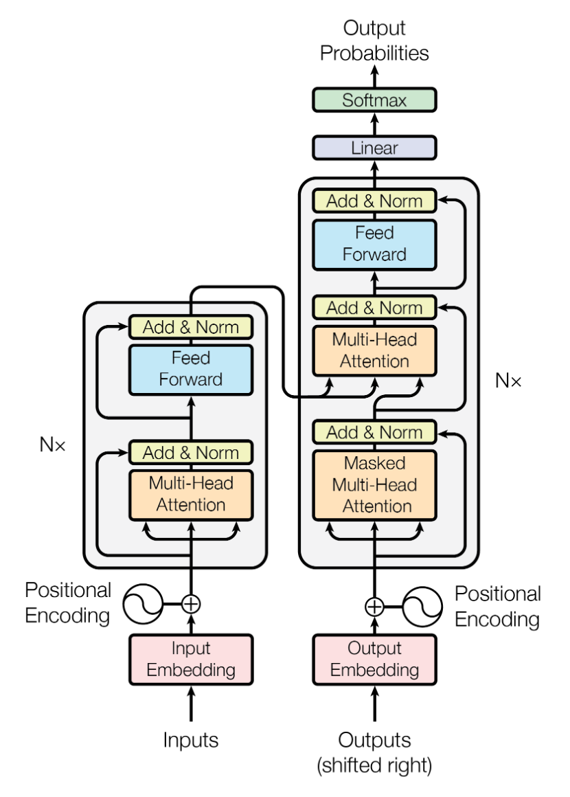
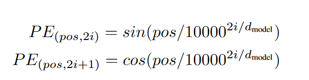
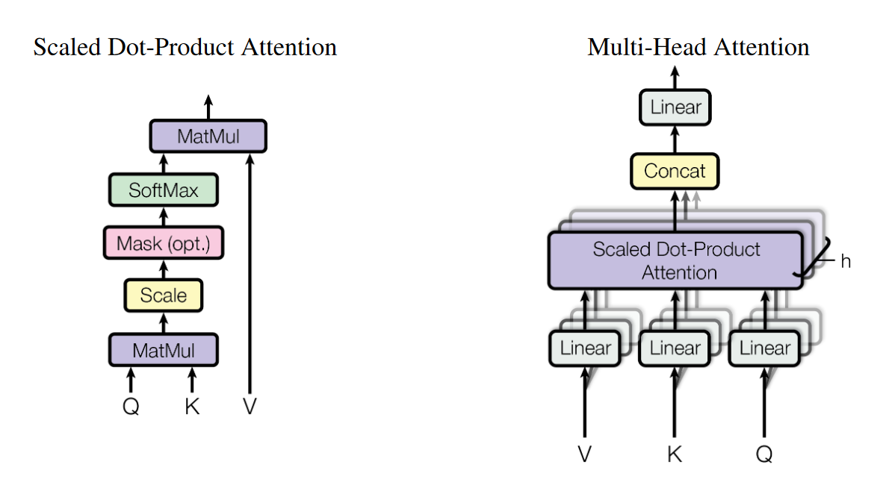
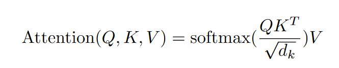
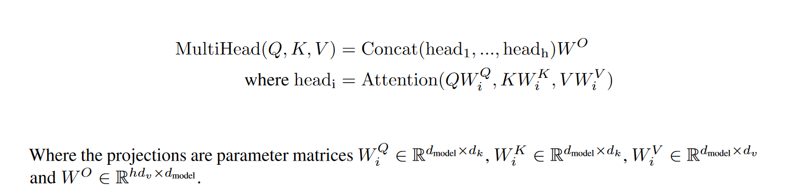
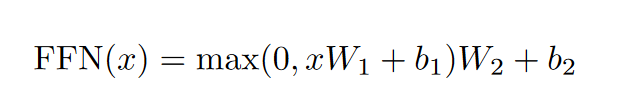

# Transformer Demo

这是一个简单的用 `pytorch` 搭建的 Transformer 框架示例，只是根据原论文给出的结构图写的一个基础版本，没有做其他的结构及性能上的优化。

## How to Start

```bash
python main.py
```

## 项目结构

本项目主要借鉴了 [nlp-tutorial/5-1.Transformer](https://github.com/graykode/nlp-tutorial/tree/master/5-1.Transformer) 文件，并在其基础上进行模块文件拆分及重要代码注释，使其结构更加清晰

- `model`:
  - `config.json`: 包含模型构建中需要用到的参数
  - `vocab.json`: 示例词表
- `utils.py`: 杂项函数
- `pe.py`: 位置编码模块
- `mha.py`: 多头注意力机制模块
- `ffn.py`: 前馈神经网络模块
- `enc.py`: 编码模块
- `dec.py`: 解码模块
- `trm.py`: Transformer 模型
- `main.py`: 主函数文件

# 原论文中关于模型搭建的重要图片

- 主要框架



- 位置编码



- 注意力机制





- 前馈神经网络

